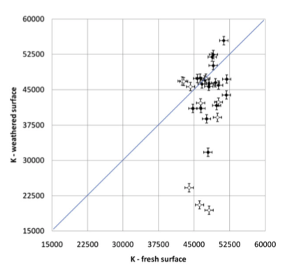

## Introduction: This paper seeks to develop a method for the determination of Inka building stones' geological provenances using portable x-ray fluorescence (pXRF) spectrometry. Ogburn et al. present pXRF readings taken on weathered and fresh samples of stone to determine the degree of contamination on weathered samples as compared with fresh ones. The authors seek to determine whether archaeologists can reliably use pXRF readings of building stone surfaces to compare with geological samples, or whether the contamination of the exterior surface interferes with the results of analysis.

## Visualization of Data: This paper includes mean, standard deviation, t-test, and f-test analyses of the data obtained from the pXRF readings. There are also bivariate plots of the readings for each element, comparing between materials from the Rumiqolqa and Huaccoto quarries. Using the data sets for the Rumiqolqa and Huaccoto materials, I will determine the mean and standard deviation of the Rumiqoqla set, in addition to performing a t- and f-test on the data. I will then re-create a bivariate plot with the readings for K on weathered and fresh samples of Rumiqolqa and Huaccoto materials.
```{R}
library(tidyverse)
library(dplyr)
#Loading Rumiqolqa data set
rumi <- read_csv(file="~/DEVELOPMENT/HOMEWORK/EARLE-JULIA-ADA-DATA-REANALYSIS-ASSIGNMENT/EARLE-JULIA-ADA-DATA-REANALYSIS-ASSIGNMENT/rumiqolqa.csv")
head(rumi)
```

```{R}
#Loading Huaccoto data set
huac <- read_csv(file="~/DEVELOPMENT/HOMEWORK/EARLE-JULIA-ADA-DATA-REANALYSIS-ASSIGNMENT/EARLE-JULIA-ADA-DATA-REANALYSIS-ASSIGNMENT/huaccoto.csv")
head(huac)
```
```{R}
#Means of K measurements from fresh and weathered samples
kf <- mean(rumi$`K fresh`)
kw <- mean(rumi$`K weathered`)
kf
kw
```
## Replications/Reanalysis
```{R}
#SD of K measurements from fresh and weathered samples
kfsd <- sd(rumi$`K fresh`)
kwsd <- sd(rumi$`K weathered`)
kfsd
kwsd
```
```{R}
#T-test for K
x <- rumi$`K fresh` - rumi$`K weathered`
n <- length(x)
t.test(rumi$`K fresh`, rumi$`K weathered`, df = n - 1, alternative = "two.sided", paired = TRUE)
```
```{R}
#F test for K
x <- rumi$`K fresh`
y <- rumi$`K weathered`
vt <- var.test(x, y)
vt
```

```{R}
library(ggplot2)
library(gridExtra)
```
```{R}
#Making bivariate plot displaying readings of K from weathered and fresh surfaces
kh = data.frame(x = huac$`K fresh`, y = huac$`K weathered`)
kr = data.frame(x = rumi$`K fresh`,y = rumi$`K weathered`)
ggplot(kh, aes(x,y)) + geom_point() + geom_point(data=kr, colour='red') + xlim(15000, 60000) + ylim(15000, 60000)
```

